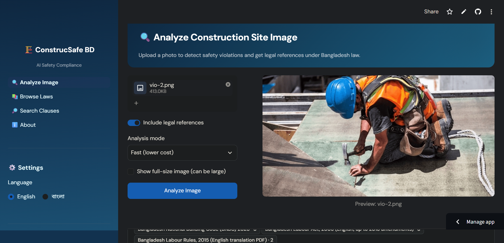
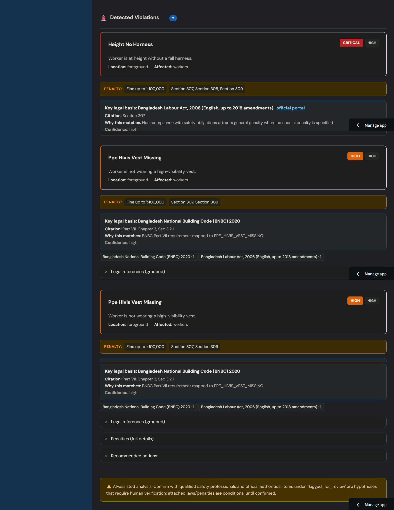
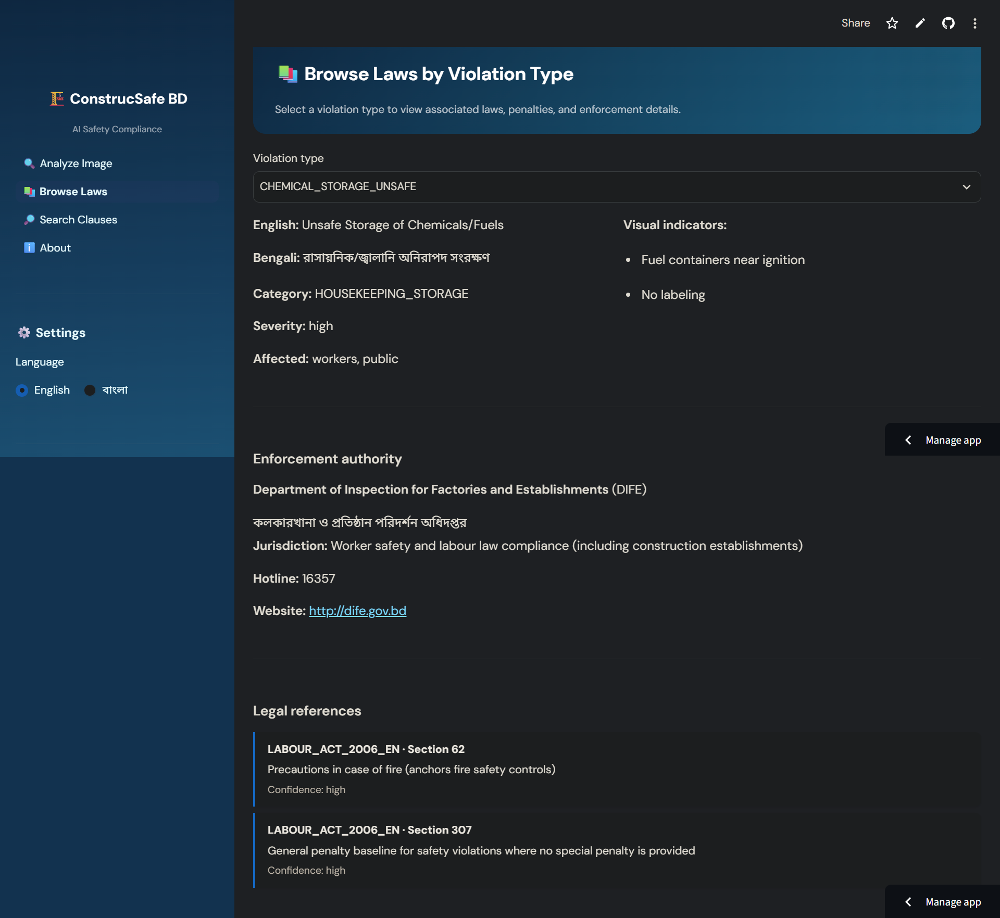
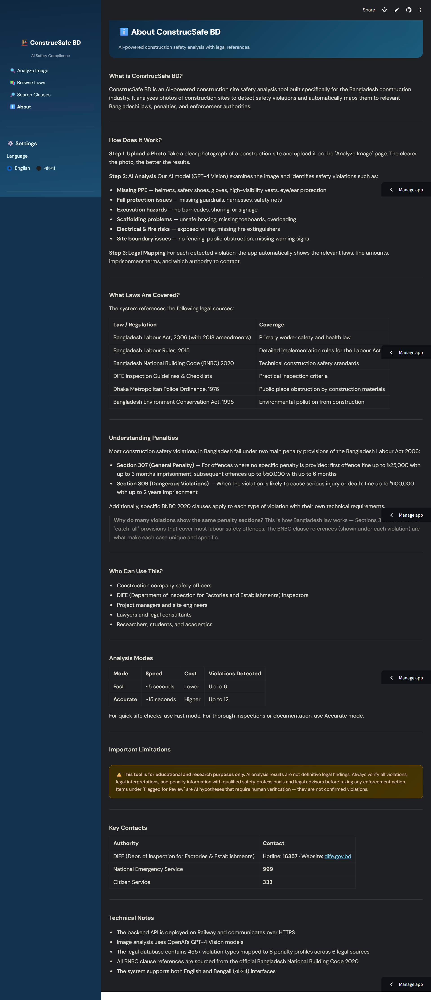

<div align="center">

# 🏗️ ConstrucSafe BD

### AI-Powered Construction Safety Violation Detection & Legal Compliance System for Bangladesh

[](https://construcsafe-bd.streamlit.app/)
[](https://construcsafe-bd-production.up.railway.app/health)
[](#)
[](#)
[](LICENSE)

**Upload a construction site photo → AI detects safety violations → Automatically mapped to Bangladesh laws, penalties & enforcement authorities**

[Live Demo](https://construcsafe-bd.streamlit.app/) · [API Health Check](https://construcsafe-bd-production.up.railway.app/health) · [Report Bug](https://github.com/mh-hamim/ConstrucSafe-BD/issues)

</div>

---

## 📋 Table of Contents

- [Overview](#overview)
- [Key Features](#key-features)
- [System Architecture](#system-architecture)
- [Tech Stack](#tech-stack)
- [Legal Database](#legal-database)
- [Project Structure](#project-structure)
- [Getting Started](#getting-started)
- [API Reference](#api-reference)
- [Screenshots](#screenshots)
- [Detectable Violation Categories](#detectable-violation-categories)
- [Disclaimer](#disclaimer)
- [License](#license)

---

## Overview

ConstrucSafe BD is an end-to-end AI system that analyzes photographs of construction sites in Bangladesh to automatically detect safety violations, match them against the national legal framework, and present actionable compliance reports with penalty information and enforcement authority contacts.

The system addresses a critical gap in Bangladesh's construction safety landscape — where manual inspections are infrequent and site managers often lack easy access to the complex web of safety regulations spanning multiple laws and codes. ConstrucSafe BD bridges that gap by combining computer vision with a comprehensive legal knowledge base covering **455 canonical violation types** across **6 legal sources**.

### Problem Statement

Bangladesh's construction industry faces significant safety challenges:
- **Limited inspection capacity** — DIFE (Department of Inspection for Factories and Establishments) cannot physically inspect every active construction site
- **Complex regulatory landscape** — Safety requirements are scattered across the Labour Act, Labour Rules, BNBC 2020, and multiple other regulations
- **Knowledge gap** — Site managers and safety officers often lack awareness of specific legal provisions and associated penalties
- **Language barrier** — Most legal texts are in English, while many site-level workers and supervisors are more comfortable in Bengali

### Solution

ConstrucSafe BD provides an accessible, bilingual (English/Bengali) web interface where users can upload a site photograph and instantly receive a detailed safety compliance report including detected violations with severity ratings, the specific laws and BNBC clauses violated, applicable penalty amounts and imprisonment terms, and the correct enforcement authority to contact.

---

## Key Features

| Feature | Description |
|---|---|
| **AI Vision Analysis** | GPT-4o / GPT-4o-mini powered detection of PPE violations, fall hazards, scaffolding issues, electrical risks, excavation dangers, and more |
| **Legal Mapping Engine** | Automatic matching of detected violations to Bangladesh Labour Act 2006, Labour Rules 2015, BNBC 2020, and 3 additional legal sources |
| **455 Violation Types** | Comprehensive database of canonical violations with visual indicators, affected parties, and severity classifications |
| **8 Penalty Profiles** | Structured penalty data including fine ranges (BDT), imprisonment terms, first/subsequent offence distinctions |
| **146 BNBC Clause Library** | Full-text searchable clause references from Bangladesh National Building Code 2020 |
| **Dual Analysis Modes** | Fast mode (GPT-4o-mini, ~5s, up to 6 violations) and Accurate mode (GPT-4o, ~15s, up to 12 violations) |
| **Bilingual Interface** | Full English and Bengali (বাংলা) UI with translated labels, severity badges, and navigation |
| **Severity Classification** | Four-tier system — Critical, High, Medium, Low — with color-coded visual hierarchy |
| **Flagged for Review** | Uncertain detections are separated into a review section rather than presented as confirmed violations |
| **Sensitive Detection Guards** | Child labour and underage worker detections require exceptionally high visual certainty to avoid false positives |
| **Authority Contact Info** | Direct hotline numbers and websites for DIFE, DMP, DOE, and BRTA |
| **BNBC Text Search** | Free-text search across the BNBC clause library to find relevant regulations by keyword |
| **Rate Limiting & Caching** | Per-IP rate limiting and response caching to control API costs and prevent abuse |

---

## System Architecture

```
┌─────────────────────────────────────────────────────────────────┐
│                        USER (Browser)                           │
│                  construcsafe-bd.streamlit.app                  │
└──────────────────────────┬──────────────────────────────────────┘
                           │ HTTPS
                           ▼
┌─────────────────────────────────────────────────────────────────┐
│                    FRONTEND (Streamlit Cloud)                   │
│                                                                 │
│  ┌──────────┐  ┌──────────────┐  ┌───────────┐  ┌───────────┐   │
│  │ Analyze  │  │ Browse Laws  │  │  Search   │  │   About   │   │
│  │  Page    │  │    Page      │  │   Page    │  │   Page    │   │
│  └────┬─────┘  └──────┬───────┘  └─────┬─────┘  └───────────┘   │
│       │               │               │                         │
│  ┌────▼───────────────▼───────────────▼──────┐                  │
│  │         API Client (requests)             │                  │
│  │     utils/api_client.py                   │                  │
│  └────────────────────┬──────────────────────┘                  │
└───────────────────────┼─────────────────────────────────────────┘
                        │ HTTPS (REST)
                        ▼
┌─────────────────────────────────────────────────────────────────┐
│                    BACKEND (Railway)                            │
│               FastAPI + Uvicorn + Python 3.12                   │
│                                                                 │
│  ┌──────────────────────────────────────────────────────────┐   │
│  │                   API Layer (FastAPI)                    │   │
│  │  /api/v1/analyze    POST  — Image analysis               │   │
│  │  /api/v1/laws/*     GET   — Violations, authorities      │   │
│  │  /api/v1/reports/*  POST  — PDF report generation        │   │
│  │  /health            GET   — Status check                 │   │
│  └──────┬───────────────────────────────┬───────────────────┘   │
│         │                               │                       │
│  ┌──────▼──────────┐   ┌───────────────▼────────────────┐       │
│  │ Vision Analyzer │   │        Law Matcher             │       │
│  │  (OpenAI API)   │   │  (JSON knowledge base)         │       │
│  │                 │   │                                │       │
│  │ • GPT-4o        │   │ • 455 canonical violations     │       │
│  │ • GPT-4o-mini   │   │ • 141 micro-violations         │       │
│  │ • System prompt │   │ • 146 BNBC clauses             │       │
│  │ • Image quality │   │ • 8 penalty profiles           │       │
│  │   assessment    │   │ • 4 enforcement authorities    │       │
│  └─────────────────┘   │ • 8 source catalog entries     │       │
│                        └────────────────────────────────┘       │
│  ┌─────────────────┐   ┌────────────────────────────────┐       │
│  │  Usage Limiter  │   │        Cache Store             │       │
│  │  (per-IP rate)  │   │   (response caching)           │       │
│  └─────────────────┘   └────────────────────────────────┘       │
└─────────────────────────────────────────────────────────────────┘
                        │
                        ▼ (API call)
              ┌───────────────────┐
              │   OpenAI API      │
              │   GPT-4o Vision   │
              └───────────────────┘
```

### Data Flow

1. User uploads a construction site image via the Streamlit frontend
2. Frontend sends the image as multipart form data to the backend `/api/v1/analyze` endpoint
3. Backend preprocesses the image and assesses quality (blur, resolution, lighting)
4. Vision Analyzer sends the image to OpenAI GPT-4o/4o-mini with a specialized construction safety system prompt
5. GPT returns detected violations as structured JSON with violation IDs, descriptions, severity, and confidence
6. Law Matcher enriches each violation with legal references, penalty profiles, BNBC clauses, and authority contacts from the knowledge base
7. Sensitive detections (e.g., child labour) are filtered through additional confidence thresholds
8. Low-confidence detections are separated into "Flagged for Review"
9. Complete response is returned to the frontend for rendering

---

## Tech Stack

### Backend
| Component | Technology |
|---|---|
| Framework | FastAPI 0.100+ |
| Runtime | Python 3.12, Uvicorn |
| AI Model | OpenAI GPT-4o (accurate) / GPT-4o-mini (fast) |
| Data | JSON knowledge base (laws.json — 455 violations, 146 BNBC clauses) |
| Deployment | Railway (Docker) |
| Security | Per-IP rate limiting, daily quota, CORS middleware |

### Frontend
| Component | Technology |
|---|---|
| Framework | Streamlit 1.30+ |
| Language | Python 3.12 |
| Styling | Custom CSS (DM Sans + Noto Sans Bengali fonts) |
| Image Processing | Pillow (PIL) |
| Data Display | Pandas DataFrames |
| Deployment | Streamlit Community Cloud |
| i18n | Custom translation module (English + Bengali) |

---

## Legal Database

The legal knowledge base (`backend/data/laws.json`) contains structured data from 6 Bangladesh legal sources:

| # | Source | ID | Coverage |
|---|---|---|---|
| 1 | Bangladesh National Building Code 2020 | `BNBC_2020` | Technical construction safety standards, structural requirements |
| 2 | Bangladesh Labour Act, 2006 (up to 2018 amendments) | `BLA_2006_2018` | Worker safety, health provisions, penalty sections 307 & 309 |
| 3 | Bangladesh Labour Rules, 2015 (English translation) | `BLR_2015_EN` | Detailed PPE requirements, safety equipment specifications |
| 4 | DIFE Inspection Guidelines & Checklists | `DIFE_CHECKLIST` | Practical inspection criteria and compliance checklists |
| 5 | Dhaka Metropolitan Police Ordinance, 1976 | `DMPO_1976` | Public place obstruction by construction materials |
| 6 | Bangladesh Environment Conservation Act, 1995 | `BECA_1995` | Construction-related environmental pollution |

### Penalty Structure

Most construction safety violations in Bangladesh fall under two primary penalty provisions:

| Section | Applicability | First Offence | Subsequent |
|---|---|---|---|
| **Section 307** (General) | Violations with no specific penalty provision | Fine up to ৳25,000 + up to 3 months imprisonment | Fine up to ৳50,000 + up to 6 months |
| **Section 309** (Dangerous) | Violations likely to cause serious injury or death | Fine up to ৳100,000 + up to 2 years imprisonment | Enhanced penalties |

### Enforcement Authorities

| Authority | Hotline | Jurisdiction |
|---|---|---|
| DIFE (কলকারখানা ও প্রতিষ্ঠান পরিদর্শন অধিদপ্তর) | **16357** | Worker safety & labour law compliance |
| Dhaka Metropolitan Police | — | Public place obstruction within Dhaka |
| Department of Environment | — | Construction-related environmental pollution |
| BRTA / Traffic Police | — | Road transport and traffic obstruction |

---

## Project Structure

```
ConstrucSafe-BD/
│
├── .github/
│   └── workflows/
│       └── ci.yml                      # GitHub Actions CI (pytest on push/PR)
│
├── backend/                            # FastAPI backend (deployed on Railway)
│   ├── __init__.py
│   ├── main.py                         # FastAPI app, CORS, router mounting
│   ├── config.py                       # Settings (env vars, model config)
│   │
│   ├── data/
│   │   └── laws.json                   # Legal knowledge base (1.8 MB)
│   │                                     # 455 canonical violations
│   │                                     # 141 micro-violations
│   │                                     # 146 BNBC clauses
│   │                                     # 8 penalty profiles
│   │                                     # 4 authorities, 8 source catalog entries
│   │
│   ├── routers/
│   │   ├── analyze.py                  # POST /api/v1/analyze — image analysis
│   │   ├── laws.py                     # GET  /api/v1/laws/* — violations, authorities
│   │   └── reports.py                  # POST /api/v1/reports/generate — PDF report
│   │
│   ├── services/
│   │   ├── vision_analyzer.py          # OpenAI GPT-4o/mini integration
│   │   ├── law_matcher.py              # Violation → laws/penalties/clauses matching
│   │   ├── cache_store.py              # Response caching
│   │   └── usage_limiter.py            # Per-IP rate limiting
│   │
│   ├── prompts/
│   │   └── construction.py             # System prompt + user prompt template
│   │
│   ├── models/
│   │   ├── requests.py                 # Pydantic request models
│   │   └── responses.py                # Pydantic response models
│   │
│   └── utils/
│       └── image_processing.py         # Image quality assessment (blur, resolution)
│
├── streamlit_app/                      # Streamlit frontend (deployed on Streamlit Cloud)
│   ├── app.py                          # Entry point (redirects to Analyze page)
│   │
│   ├── .streamlit/
│   │   └── config.toml                 # Streamlit theme and configuration
│   │
│   ├── assets/
│   │   ├── style.css                   # Custom CSS (DM Sans, severity colors, cards)
│   │   └── source_catalog.json         # Source metadata for display
│   │
│   ├── pages/                          # Streamlit multipage app
│   │   ├── Analyze.py                  # Main analysis page (upload + results)
│   │   ├── Browse_Laws.py              # Browse violations and their legal details
│   │   ├── Search_Laws.py              # BNBC clause text search
│   │   └── About.py                    # Comprehensive about page (EN + BN)
│   │
│   ├── components/                     # Reusable UI components
│   │   ├── violation_card.py           # Violation card with severity, penalties, laws
│   │   ├── summary_metrics.py          # KPI metric cards (total, high, medium, low)
│   │   └── flagged_item.py             # Flagged-for-review item component
│   │
│   └── utils/                          # Frontend utilities
│       ├── api_client.py               # HTTP client for backend API
│       ├── config.py                   # App configuration (API URL, timeout)
│       ├── i18n.py                     # Internationalization (60+ strings, EN + BN)
│       ├── ui.py                       # Sidebar, CSS loader, backend status
│       └── source_catalog.py           # Source title/URL helpers
│
├── tests/                              # Pytest test suite
│   ├── conftest.py                     # Test fixtures (mocked VisionAnalyzer)
│   ├── test_health.py                  # Health endpoint tests
│   ├── test_analyze.py                 # Analysis endpoint tests
│   └── test_laws.py                    # Laws endpoint tests
│
├── .dockerignore
├── .env.example                        # Environment variable template
├── .gitignore
├── Dockerfile                          # Backend Docker config (Railway-ready)
├── README.md
└── requirements.txt
```

---

## Getting Started

### Prerequisites

- Python 3.10+
- An [OpenAI API key](https://platform.openai.com/api-keys) with access to GPT-4o models

### 1. Clone the Repository

```bash
git clone https://github.com/mh-hamim/ConstrucSafe-BD.git
cd ConstrucSafe-BD
```

### 2. Backend Setup

```bash
# Create and activate virtual environment
python -m venv .venv
source .venv/bin/activate        # Linux/macOS
# .venv\Scripts\activate         # Windows

# Install dependencies
pip install -r requirements.txt

# Configure environment
cp .env.example .env
# Edit .env and add your OPENAI_API_KEY

# Run backend locally
uvicorn backend.main:app --host 0.0.0.0 --port 8000 --reload
```

Verify: `curl http://localhost:8000/health` → `{"status":"ok","version":"1.0.0"}`

### 3. Frontend Setup

```bash
# (Optional) Point frontend to local backend instead of Railway
export CONSTRUCSAFE_API_BASE_URL=http://localhost:8000

# Run Streamlit
cd streamlit_app
streamlit run app.py
```

The frontend will open at `http://localhost:8501`.

### 4. Run Tests

```bash
pytest -q
```

### 5. Docker (Backend Only)

```bash
docker build -t construcsafe-backend .
docker run -p 8000:8000 --env-file .env construcsafe-backend
```

---

## API Reference

Base URL: `https://construcsafe-bd-production.up.railway.app`

### Health Check

```
GET /health
→ {"status": "ok", "version": "1.0.0"}
```

### Analyze Image

```
POST /api/v1/analyze?include_laws=true&mode=fast
Content-Type: multipart/form-data
```

| Parameter | Type | Default | Description |
|---|---|---|---|
| `file` | File (form) | required | JPG/JPEG/PNG image, max 10 MB |
| `include_laws` | Query (bool) | `true` | Include legal references in response |
| `mode` | Query (string) | `fast` | `fast` (GPT-4o-mini, up to 6) or `accurate` (GPT-4o, up to 12) |

### List All Violations

```
GET /api/v1/laws/violations
```

### Get Violation Details

```
GET /api/v1/laws/violations/{violation_id}
```

### Get Authority Info

```
GET /api/v1/laws/authorities/{authority_id}
```

### Search BNBC Clauses

```
GET /api/v1/laws/match-text?text=guardrail&top_k=5
```

### Generate PDF Report

```
POST /api/v1/reports/generate
```

---

## Environment Variables

| Variable | Required | Default | Description |
|---|---|---|---|
| `OPENAI_API_KEY` | ✅ | — | OpenAI API key |
| `OPENAI_MODEL_FAST` | ❌ | `gpt-4o-mini` | Model for fast analysis mode |
| `OPENAI_MODEL_ACCURATE` | ❌ | `gpt-4o` | Model for accurate analysis mode |
| `MAX_IMAGE_SIZE_MB` | ❌ | `10` | Maximum upload size |
| `CORS_ALLOW_ORIGINS` | ❌ | `*` | Comma-separated allowed origins |
| `RATE_LIMIT_PER_IP` | ❌ | `10` | Requests per rate window per IP |
| `DAILY_QUOTA_PER_IP` | ❌ | `50` | Daily request limit per IP |
| `CACHE_TTL_SECONDS` | ❌ | `3600` | Response cache duration |
| `CONSTRUCSAFE_API_BASE_URL` | ❌ | Railway URL | Backend URL (frontend config) |

---

## Screenshots

### Analysis Page — Violation Detection
Upload a construction site photo and receive an instant safety compliance report with severity-rated violations, inline penalty summaries, and legal references.



### Analysis Results — Detected Violations
Violations sorted by severity (Critical → High → Medium → Low) with color-coded cards, penalty summaries, and expandable legal details.



### Browse Laws — Violation Explorer
Browse all 455 violation types with their legal references, visual indicators, enforcement authorities, and penalty details.



### About Page — User Guide
Comprehensive bilingual (English/Bengali) guide explaining the system, covered laws, penalty structure, and key contacts.



---

## Detectable Violation Categories

| Category | Examples |
|---|---|
| **PPE (Personal Protective Equipment)** | Missing helmet, safety shoes, gloves, high-visibility vest, eye/ear protection |
| **Fall Protection** | Missing guardrails, harnesses not used, no safety nets, unprotected open edges |
| **Scaffolding** | Missing toeboards, improper bracing, overloading, damaged planks |
| **Excavation** | No barricades, missing shoring/bracing, no warning signs |
| **Electrical Safety** | Exposed wiring, no GFCI, missing lockout-tagout |
| **Fire Safety** | No fire extinguishers, blocked exits, improper hot work |
| **Site Boundary** | No perimeter fencing, public obstruction, missing warning signs |
| **Housekeeping** | Debris on walkways, improper material storage, blocked access |
| **Environmental** | Excessive dust, noise pollution, improper waste disposal |
| **Child Labour** | Underage workers (requires high visual certainty, guarded detection) |

---

## Disclaimer

> ⚠️ **This tool is for educational and research purposes only.**
>
> AI analysis results are not definitive legal findings. The system may produce false positives or miss violations that are not clearly visible in the photograph. Always verify all violations, legal interpretations, and penalty information with qualified safety professionals and legal advisors before taking any enforcement action.
>
> Items under "Flagged for Review" are AI hypotheses that require human verification — they are not confirmed violations. Attached laws and penalties are conditional until confirmed by authorized inspectors.

---

## License

This project is licensed under the [MIT License](LICENSE).

```
MIT License

Copyright (c) 2025 Mahmudul Hasan Hamim

Permission is hereby granted, free of charge, to any person obtaining a copy
of this software and associated documentation files (the "Software"), to deal
in the Software without restriction, including without limitation the rights
to use, copy, modify, merge, publish, distribute, sublicense, and/or sell
copies of the Software, and to permit persons to whom the Software is
furnished to do so, subject to the following conditions:

The above copyright notice and this permission notice shall be included in all
copies or substantial portions of the Software.

THE SOFTWARE IS PROVIDED "AS IS", WITHOUT WARRANTY OF ANY KIND, EXPRESS OR
IMPLIED, INCLUDING BUT NOT LIMITED TO THE WARRANTIES OF MERCHANTABILITY,
FITNESS FOR A PARTICULAR PURPOSE AND NONINFRINGEMENT. IN NO EVENT SHALL THE
AUTHORS OR COPYRIGHT HOLDERS BE LIABLE FOR ANY CLAIM, DAMAGES OR OTHER
LIABILITY, WHETHER IN AN ACTION OF CONTRACT, TORT OR OTHERWISE, ARISING FROM,
OUT OF OR IN CONNECTION WITH THE SOFTWARE OR THE USE OR OTHER DEALINGS IN THE
SOFTWARE.
```

The legal data referenced in this project is sourced from publicly available Bangladesh government publications.

---

<div align="center">

**Built with 🇧🇩 for safer construction sites in Bangladesh**

[Live Demo](https://construcsafe-bd.streamlit.app/) · [API](https://construcsafe-bd-production.up.railway.app/health) · [Issues](https://github.com/mh-hamim/ConstrucSafe-BD/issues)

</div>